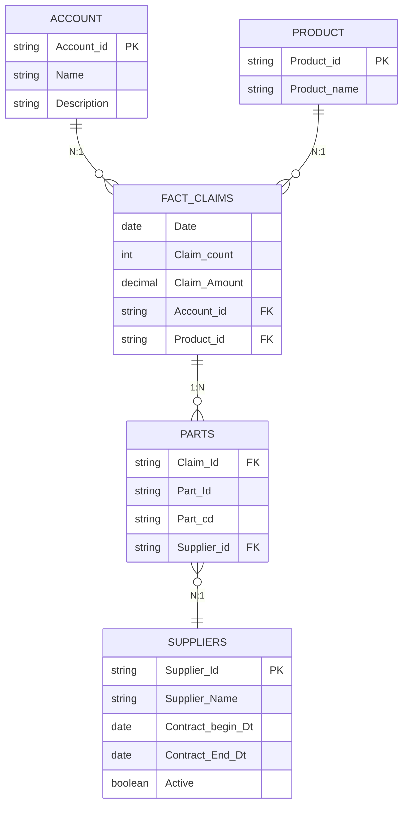

# Warranty Claims Schema

Star schema for the warranty claims data model: `Fact_Claims` at claim grain, two conformed dimensions (`Account`, `Product`), and a `Parts` bridge table resolving the claim–parts many-to-many relationship.

## Entity-relationship diagram

## Design notes

**Grain:** `Fact_Claims` holds one row per claim (`Claim_count`, `Claim_Amount` at that grain). `Account_id` and `Product_id` are foreign keys directly on the fact table, since a claim belongs to exactly one account and one product.

**Why `Parts` is a bridge, not a dimension:** a single claim can involve multiple parts, and a given part recurs across many claims — a true many-to-many. A plain dimension can't model that, so `Parts` is a bridge/associative table: one row per part-on-a-claim, carrying `Claim_Id`, `Part_Id`, and the `Supplier_id` for that specific part.

**Why `Suppliers` hangs off `Parts`, not `Fact_Claims`:** supplier is a property of the *part* used, not of the claim itself — different parts on the same claim can come from different suppliers. `Suppliers` is therefore a dimension of the `Parts` bridge (a small snowflake off the star), reachable only by joining through `Parts`.

## Reporting note (fan-out)

`Fact_Claims` must stay at one row per claim. Joining `Parts` directly into a claim-level report causes fan-out — `Claim_Amount` would repeat once per part row on that claim. Aggregate `Parts` separately (e.g., part count or distinct parts per claim) before joining back to `Fact_Claims`, rather than flattening the two together.
